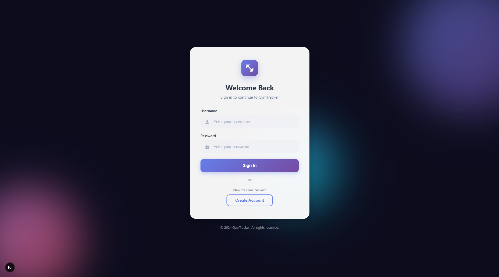
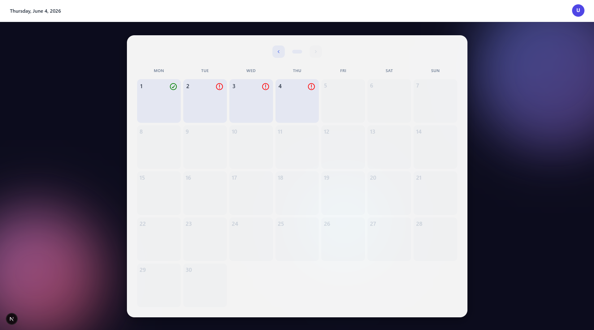
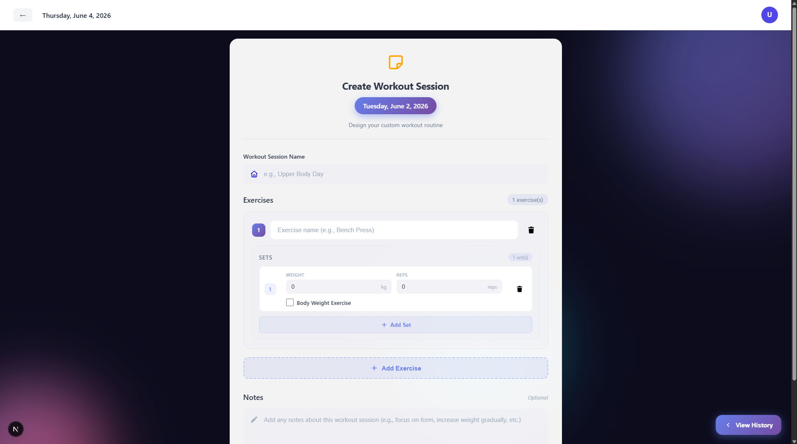
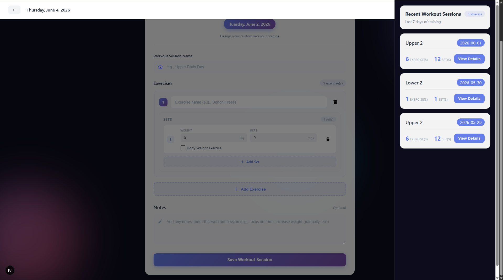

# Gym Tracker App

A full-stack fitness tracking application that allows users to create, manage, and track workout sessions over time.

The application provides workout history management, progression tracking, calendar-based workout visualization, and secure authentication using JWT Access Tokens and Refresh Token Rotation.

---

## Features

### Authentication

* User Registration
* User Login
* JWT Access Token Authentication
* Refresh Token Rotation
* Automatic Access Token Renewal
* Route Protection using Next.js Middleware

### Workout Management

* Create Workout Sessions
* Update Existing Workout Sessions
* Track Exercises and Sets
* Calendar-based Workout History

### Progress Tracking

* View Workout Progression Over Time
* Analyze Historical Workout Data

---

## Screenshots

### Login Page



### Calendar View



### Workout Session Page






---

## Technology Stack

### Frontend

* Next.js 16
* TypeScript 5
* React
* Zustand
* Axios
* React Hook Form

### Authentication

* JWT Authentication
* Refresh Token Rotation
* Cookie-based Token Storage

### Backend

* ASP.NET Core Web API

### Database

* PostgreSQL

### DevOps

* Docker Compose
* GitHub Actions

---

## Architecture

```text
Client Browser
      │
      ▼
Next.js Application
      │
      ▼
ASP.NET Core Web API
      │
      ▼
PostgreSQL
```

---

## Authentication Flow

1. User logs in using email and password.
2. Backend issues an Access Token and Refresh Token.
3. Tokens are stored in cookies.
4. Protected routes are checked by Next.js Middleware.
5. When the Access Token expires, Middleware calls the Refresh Token API.
6. Backend validates the Refresh Token.
7. A new Access Token and Refresh Token are generated.
8. Previous Refresh Token is revoked.
9. Refresh Token reuse detection is used to improve security.

---

## Project Structure

```text
src/
├── middleware.ts
├── app/
│   ├── layout.tsx
│   ├── main.scss
│   ├── (homepage)/
│   │   ├── calendar/
│   │   ├── login/
│   │   └── register/
│   ├── actions/
│   ├── components/
│   ├── context-provider/
│   ├── store/
│   └── utils/
```

---

## Installation

### Clone Repository

```bash
git clone <repository-url>
cd gym-tracker-app
```

### Install Dependencies

```bash
npm install
```

### Configure Environment Variables

Create a `.env.local` file:

```env
NEXT_PUBLIC_API_URL=
AUTH_SECRET=
```

### Run Development Server

```bash
npm run dev
```

Application will be available at:

```text
http://localhost:3000
```

---

## CI/CD

GitHub Actions is configured to:

* Run automated tests
* Build the application
* Build Docker images
* Push images to Docker Hub
* Push images to GitHub Container Registry (GHCR)

---

## Future Improvements

* SMS workout sharing
* Public deployment
* Workout analytics dashboard
* Additional progression charts
* Expanded exercise library

---

## Learning Objectives

This project was built to deepen knowledge in:

* Next.js Application Development
* ASP.NET Core Integration
* Authentication and Authorization
* Refresh Token Rotation
* State Management with Zustand
* Docker-based Development
* CI/CD Pipelines using GitHub Actions
* Full-Stack Application Architecture

```
```
